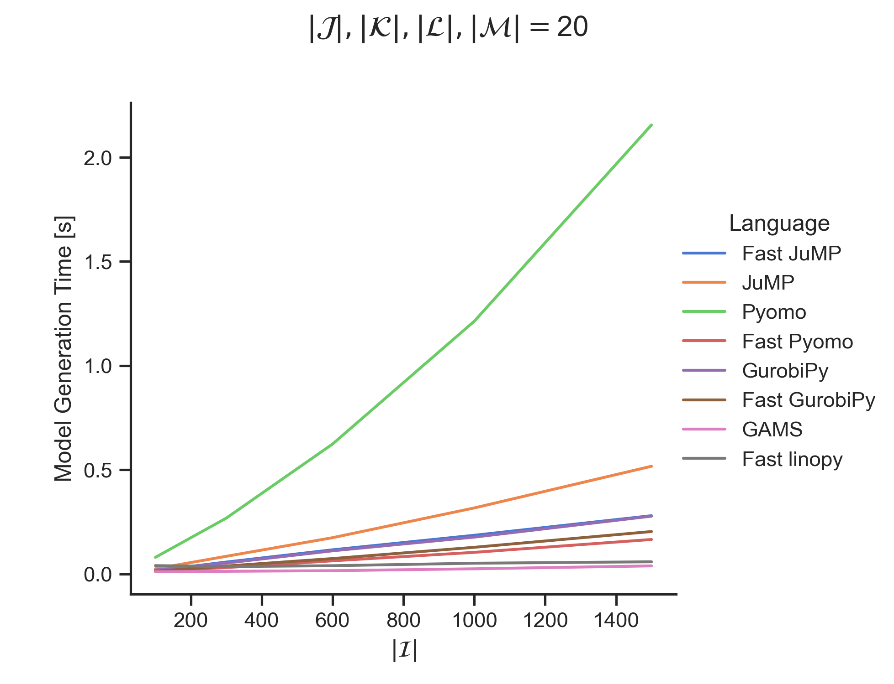
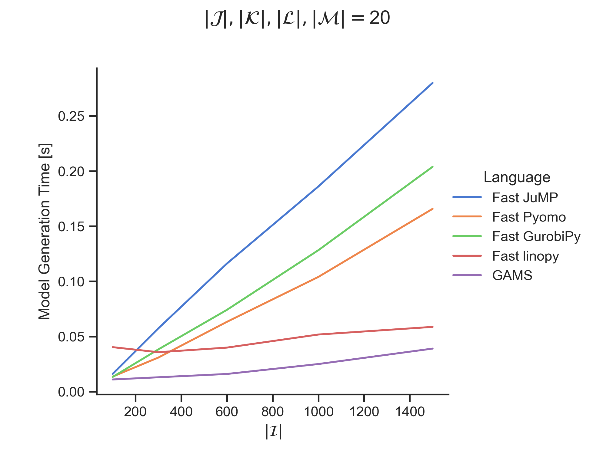
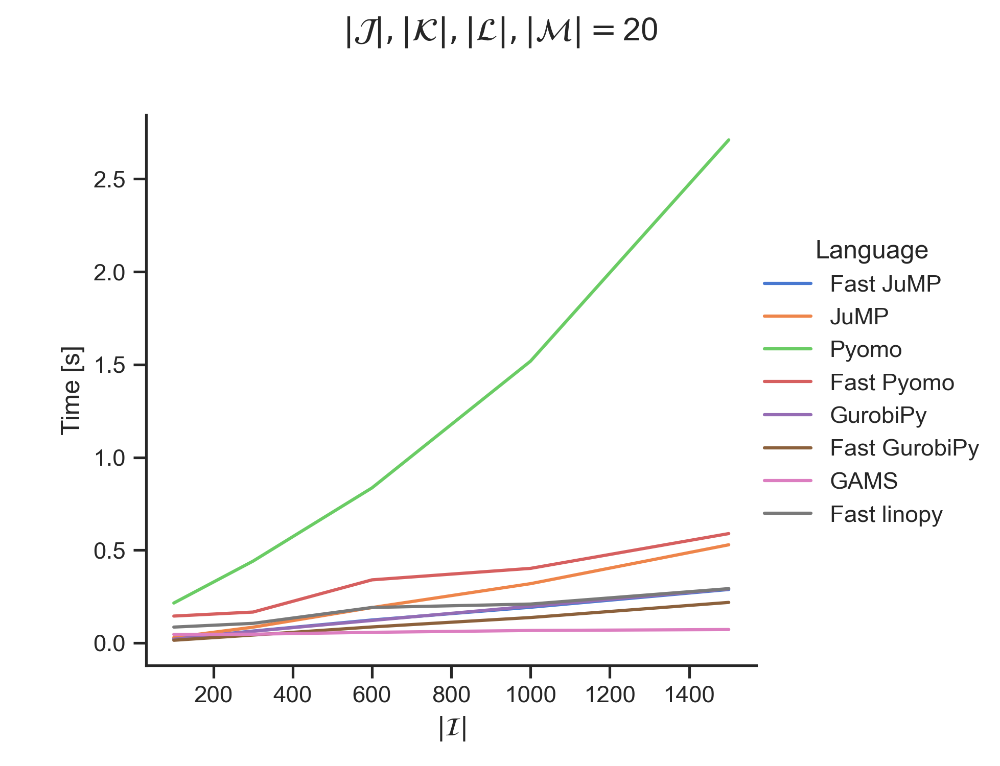
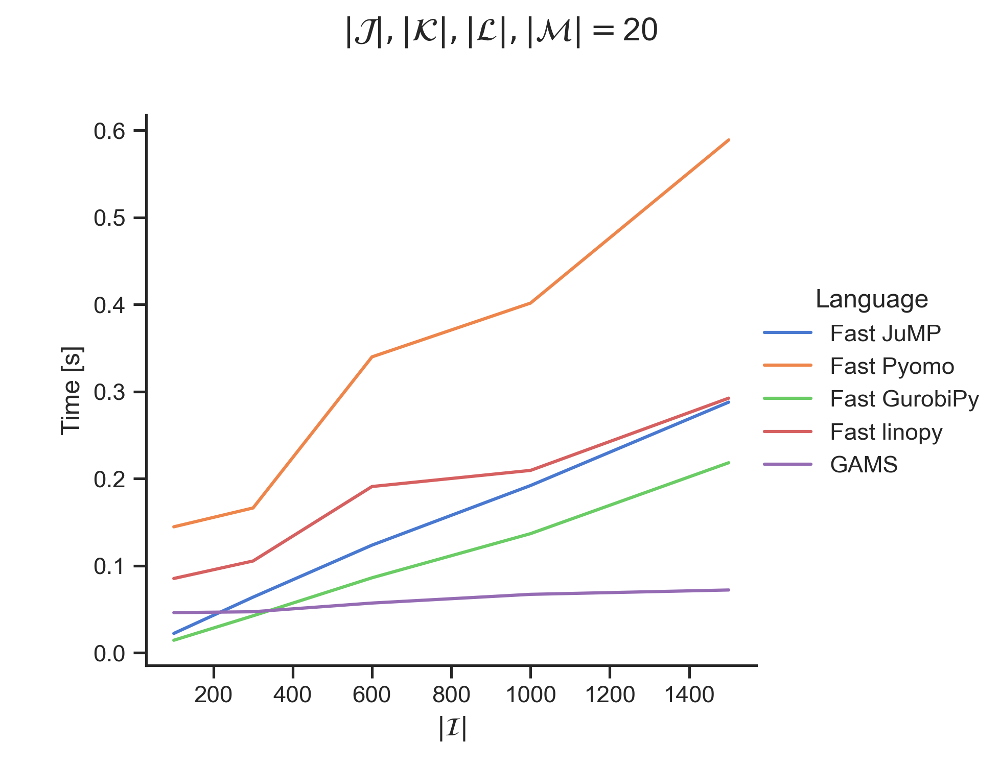
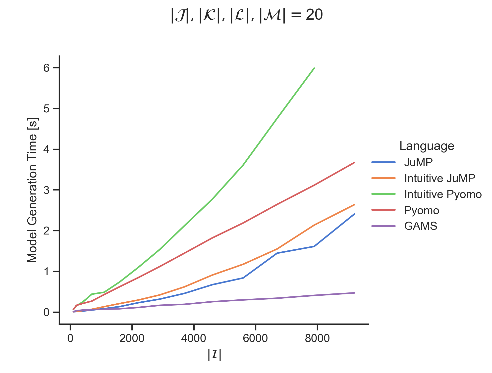
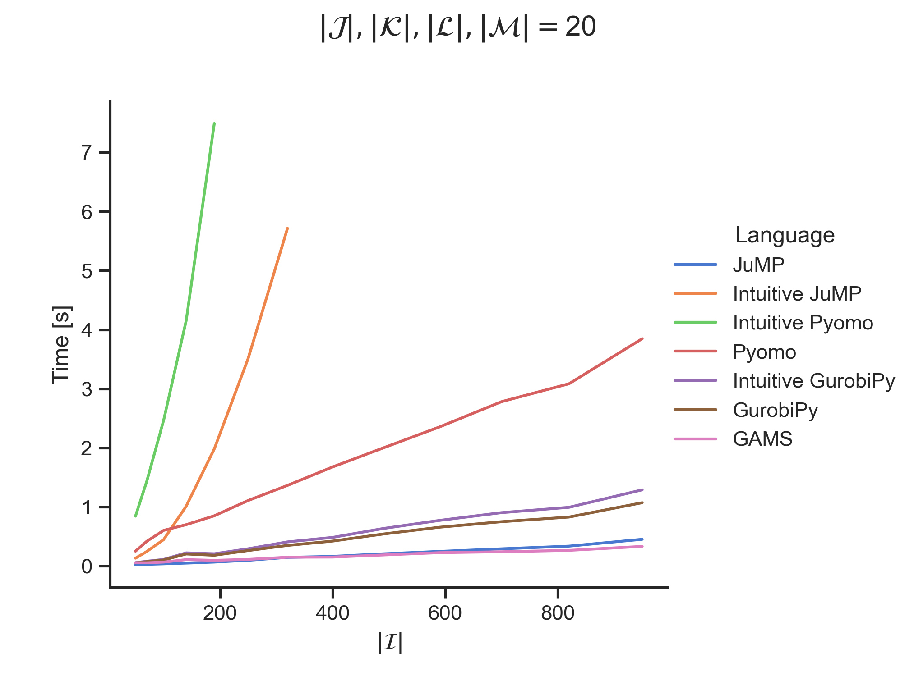

# Performance Experiment

This repository tries to make a fair comparison between the performance of Pyomo, GurobiPy, GAMS, Linopy, and JuMP. Performance is measured in model generation time and model generation plus solve time.

- Python 3.11.3
- Pyomo 6.6.0
- Julia 1.9.0
- JuMP 1.11.1
- linopy 0.2.3 
- GAMS 43.2

## Example IJKLM

### Model

$$\text{min} \ z = 1$$

$$\sum_{(j,k):(i,j,k) \in \mathcal{IJK}} \ \sum_{l:(j,k,l) \in \mathcal{JKL}} \ \sum_{m:(k,l,m) \in \mathcal{KLM}} x_{i,j,k,l,m} \ge 0 \hspace{1cm} \forall \ i \in \mathcal{I}$$

$$x_{i,j,k,l,m} \ge 0 \hspace{1cm} \forall \ (i,j,k) \in \mathcal{IJK}, l:(j,k,l) \in \mathcal{JKL}, m:(k,l,m) \in \mathcal{KLM} $$

### Model Generation Performance

### Model Generation + Solve Performance

## Example Supply Chain

### Model

$$\min F = 1$$

$$\sum_{j:(i,j,k) \in \mathcal{IJK}} x_{ijk} \ge \sum_{l:(i,k,l) \in \mathcal{IKL}} y_{ikl} \hspace{1cm} \forall \ (i,k) \in \mathcal{IK} $$

$$\sum_{k:(i,k,l) \in \mathcal{IKL}} y_{ikl} \ge \sum_{m:(i,l,m) \in \mathcal{ILM}} z_{ilm} \hspace{1cm} \forall \ (i,l) \in \mathcal{IL} $$

$$\sum_{l:(i,l,m) \in \mathcal{ILM}} z_{ilm} \ge d_{im} \hspace{1cm} \forall \ (i,m) \in \mathcal{IM}$$

| Sets                |             |
| ------------------- | --------    |
| $i \in \mathcal{I}$ | products    |
| $j \in \mathcal{J}$ | production units    |
| $k \in \mathcal{K}$ | production plants   |
| $l \in \mathcal{L}$ | distribution centers |
| $m \in \mathcal{M}$ | customers |
| $\mathcal{IK}$ | set of plants $k$ able to produce product $i$ |
| $\mathcal{IL}$ | set of products $i$ that can be stored in distribution center $l$ |
| $\mathcal{IM}$ | set of products $i$ that are ordered by customer $m$ |
| $\mathcal{IJK}$ | set of products $i$ that can be processed by production unit $j$ available at plant $k$ |
| $\mathcal{IKL}$ | set of products $i$ that can be manufactured at plant $k$ and stored in distribution center $l$ |
| $\mathcal{ILM}$ | set of products $i$ stored in distribution center $l$ and able to be supplied to customer $m$ |

| Parameters | |
| ------------------- | --------    |
| $d_{im}$ | demand for product $i$ related to customer $m$ |

| Variables | |
| ------------------- | --------    |
| $x_{ijk}$ | production quantity of product $i$ on production unit $j$ and plant $k$ |
| $y_{ikl}$ | shipping quantity of product $i$ from plant $k$ to distribution center $l$ |
| $z_{ilm}$ | delivery quantity of product $i$ from distribution center $l$ to customer $m$ |

### Model Generation Performance

### Model Generation + Solve Performance

